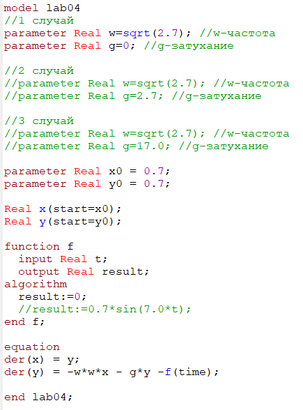
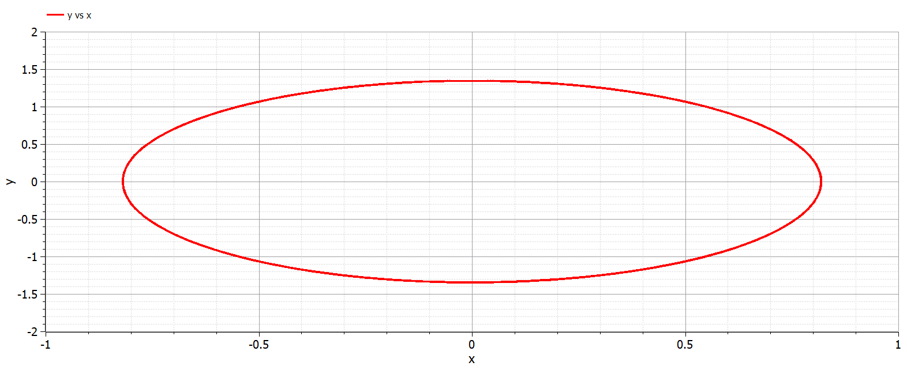
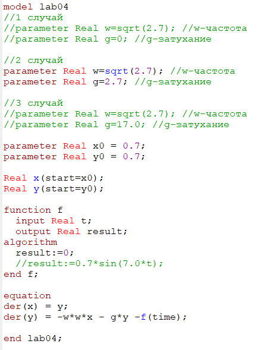
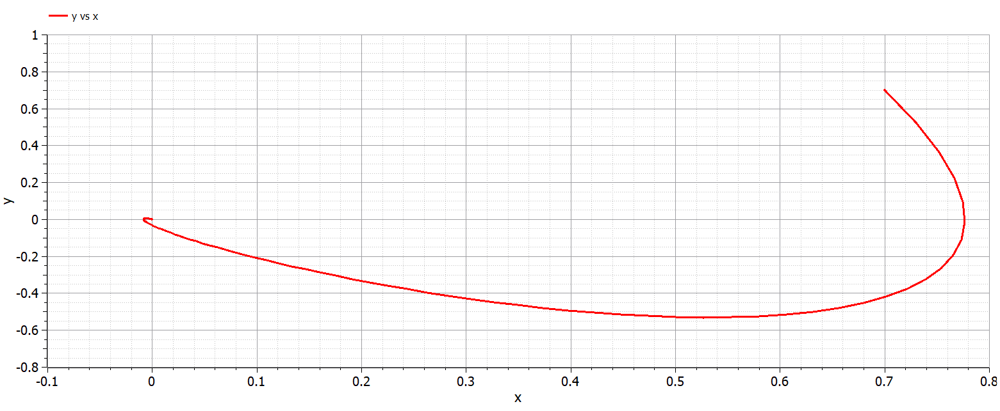
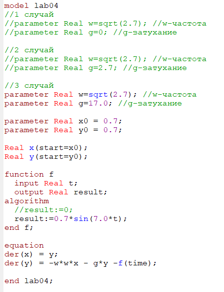
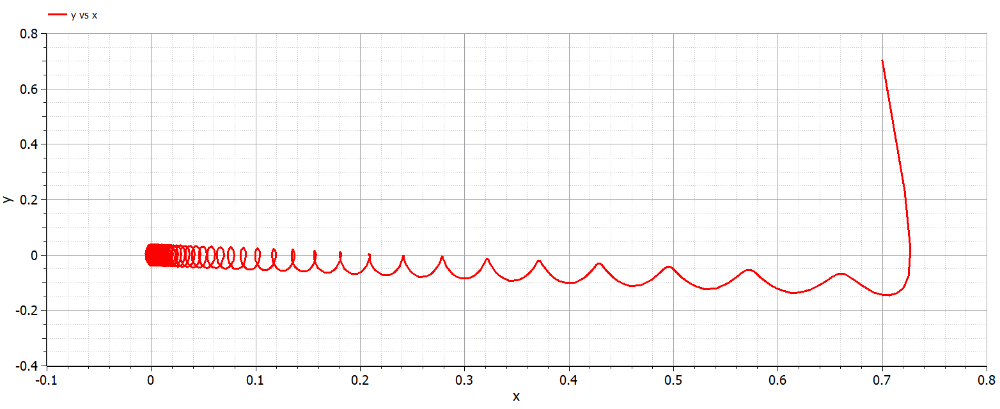

---
# Front matter
lang: ru-RU
title: "Лабораторная работа №4"
subtitle: "Модель гармонических колебаний"
author: "Валиева Найля Разимовна"

# Formatting
toc-title: "Содержание"
toc: true # Table of contents
toc_depth: 2
lof: true # List of figures
lot: true # List of tables
fontsize: 12pt
linestretch: 1.5
papersize: a4paper
documentclass: scrreprt
polyglossia-lang: russian
polyglossia-otherlangs: english
mainfont: PT Serif
romanfont: PT Serif
sansfont: PT Sans
monofont: PT Mono
mainfontoptions: Ligatures=TeX
romanfontoptions: Ligatures=TeX
sansfontoptions: Ligatures=TeX,Scale=MatchLowercase
monofontoptions: Scale=MatchLowercase
indent: true
pdf-engine: lualatex
header-includes:
  - \linepenalty=10 # the penalty added to the badness of each line within a paragraph (no associated penalty node) Increasing the value makes tex try to have fewer lines in the paragraph.
  - \interlinepenalty=0 # value of the penalty (node) added after each line of a paragraph.
  - \hyphenpenalty=50 # the penalty for line breaking at an automatically inserted hyphen
  - \exhyphenpenalty=50 # the penalty for line breaking at an explicit hyphen
  - \binoppenalty=700 # the penalty for breaking a line at a binary operator
  - \relpenalty=500 # the penalty for breaking a line at a relation
  - \clubpenalty=150 # extra penalty for breaking after first line of a paragraph
  - \widowpenalty=150 # extra penalty for breaking before last line of a paragraph
  - \displaywidowpenalty=50 # extra penalty for breaking before last line before a display math
  - \brokenpenalty=100 # extra penalty for page breaking after a hyphenated line
  - \predisplaypenalty=10000 # penalty for breaking before a display
  - \postdisplaypenalty=0 # penalty for breaking after a display
  - \floatingpenalty = 20000 # penalty for splitting an insertion (can only be split footnote in standard LaTeX)
  - \raggedbottom # or \flushbottom
  - \usepackage{float} # keep figures where there are in the text
  - \floatplacement{figure}{H} # keep figures where there are in the text
---

# Цель работы

Ознакомление с моделью линейного гармонического осциллятора  и ее построение с помощью языка программирования Modelica. 

# Задание

1. Построить фазовый портрет гармонического осциллятора и решенить уравнения гармонического осциллятора без затуханий и без действий внешней силы.
2. Построить фазовый портрет гармонического осциллятора и решенить уравнения гармонического осциллятора с затуханием и без действий внешней силы.
3. Построить фазовый портрет гармонического осциллятора и решенить уравнения гармонического осциллятора с затуханием и под действием внешней силы.

# Выполнение лабораторной работы

Вариант 52. 

Уравнение свободных колебаний гармонического осциллятора имеет следующий вид:

$$ \ddot {x} + \gamma \dot {x} + w_0^2x = f(t) $$
$x$ — переменная, описывающая состояние системы (смещение грузика, заряд конденсатора и т.д.)
$t$ — время
$w$ — частота
$\gamma$ — затухание  
Интервал: $t \in [0; 47]$ (шаг 0.05).  
Начальные условия: $x_0 = 0.7, y_0 = 0.7$  

1. Уравнение гармонического осциллятора без затухания и без действия внешней силы: 
 
$$ \ddot {x} + 2.7x = f(t) $$
где  
$w = \sqrt{2.7}$  
$\gamma = 0.0$  
$f(t) = 0.0$  

Ниже представлен код программы для первого случая, выполненный на языке программирования Modelica. (рис 1. -@fig:001)  

{ #fig:001 width=70% }  

Ниже представле график для первого случая. (рис 2. -@fig:001)  

{ #fig:001 width=70% }    

2. Уравнение гармонического осциллятора с затуханием и без действия внешней силы:  

$$ \ddot {x} + 2.7 \dot {x} + 2.7x = 0 $$
где  
$w = \sqrt{2.7}$  
$\gamma = 2.7$  
$f(t) = 0.0$  

Ниже представлен код программы для второго случая, выполненный на языке программирования Modelica. (рис 3. -@fig:001)  

{ #fig:001 width=70% }  

Ниже представле график для второго случая. (рис 4. -@fig:001)  

{ #fig:001 width=70% }    

3. Уравнение гармонического осциллятора с затуханием и под действием внешней силы:  

$$ \ddot {x} + 17 \dot {x} + 2.7x = 0.7sin(7t) $$
где  
$w = \sqrt{2.7}$  
$\gamma = 17.0$  
$f(t) = 0.7sin(7t)$  

Ниже представлен код программы для третьего случая, выполненный на языке программирования Modelica. (рис 5. -@fig:001)  

{ #fig:001 width=70% }  

График для третьего случая. (рис 6. -@fig:001)  

{ #fig:001 width=70% }  

Приведу полный код программы (Modelica):    
model lab04
//1 случай
//parameter Real w=sqrt(2.7); //w-частота
//parameter Real g=0; //g-затухание

//2 случай
//parameter Real w=sqrt(2.7); //w-частота
//parameter Real g=2.7; //g-затухание

//3 случай
parameter Real w=sqrt(2.7); //w-частота
parameter Real g=17.0; //g-затухание

parameter Real x0 = 0.7;
parameter Real y0 = 0.7;

Real x(start=x0);
Real y(start=y0);

function f 
  input Real t;
  output Real result;
algorithm
  //result:=0;
  result:=0.7*sin(7.0*t);
end f;

equation
der(x) = y;
der(y) = -w*w*x - g*y -f(time);

end lab04;

# Вопросы к лабораторной работе №4

1. Запишите простейшую модель гармонических колебаний

Простейшая модель гармонических колебаний имеет следующий вид: $$ x = x_m cos(\omega t + \phi_0) $$

2. Дайте определение осциллятора

Осциллятор  — система, которая при выведении её из положения равновесия испытывает действие возвращающей силы F, пропорциональной смещению x:

$$ F=-kx $$ 

где k — постоянный коэффициент.

3. Запишите модель математического маятника
$$\frac{\partial^2 \alpha}{\partial t^2} + \frac{\gamma}{L} sin{\alpha} = 0$$

4. Запишите алгоритм перехода от дифференциального уравнения второго порядка
к двум дифференциальным уравнениям первого порядка

Уравнение свободных колебаний гармонического осциллятора имеет
следующий вид: 
$$ \ddot {x} + \gamma \dot {x} + w_0^2x = f(t) $$

При отсутствии потерь в системе ($\gamma = 0$) вместо уравнения выше получаем
уравнение консервативного осциллятора энергия колебания которого сохраняется
во времени:

$$ \ddot {x} + w_0^2x = 0 $$

Для однозначной разрешимости уравнения второго порядка необходимо
задать два начальных условия вида(1):

$$ x(t_0) = x_0 $$
$$ \dot x(t_0) = x_0 $$

Уравнение второго порядка $$ \ddot {x} + w_0^2x = 0 $$ можно представить в виде системы двух
уравнений первого порядка(2): 

$$ \dot x = y $$
$$ \dot y = -w_0^2x $$

Начальные условия (1) для системы (2) примут вид:

$$ x(t_0) = x_0 $$
$$ y(t_0) = y_0 $$

5. Что такое фазовый портрет и фазовая траектория?

Независимые переменные x, y определяют пространство, в котором
«движется» решение. Это фазовое пространство системы, поскольку оно двумерно
будем называть его фазовой плоскостью.

Значение фазовых координат x, y в любой момент времени полностью
определяет состояние системы. Решению уравнения движения как функции
времени отвечает гладкая кривая в фазовой плоскости. Она называется **фазовой
траекторией**. Если множество различных решений (соответствующих различным 
начальным условиям) изобразить на одной фазовой плоскости, возникает общая
картина поведения системы. Такую картину, образованную набором фазовых
траекторий, называют **фазовым портретом**.

# Вывод

Я познакомилась с моделью линейного гармонического осциллятора, решив уравнения гармонического осциллятора и построив его фазовые портреты.
