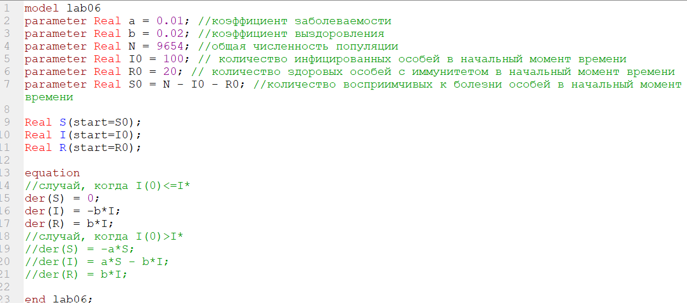
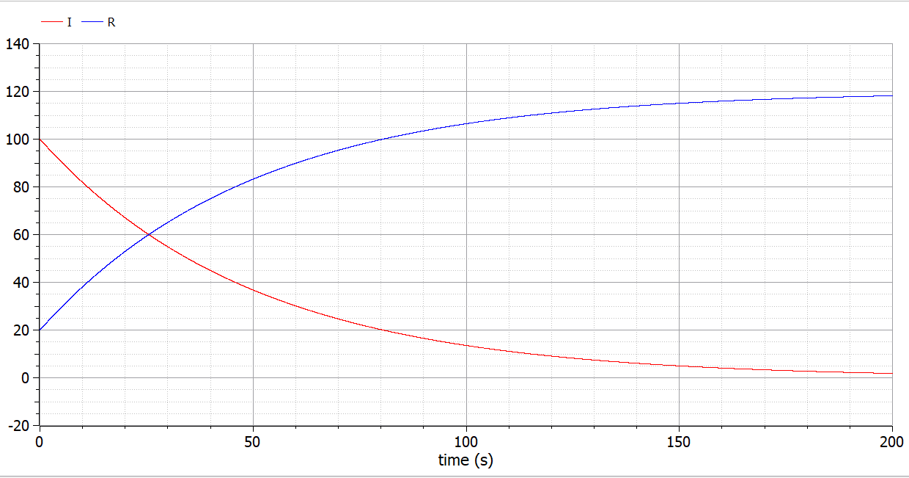
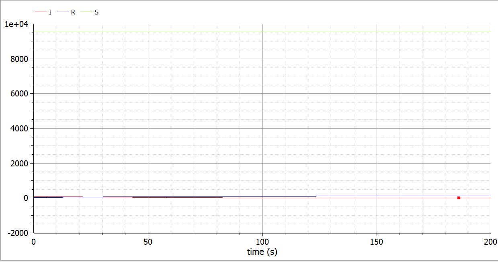
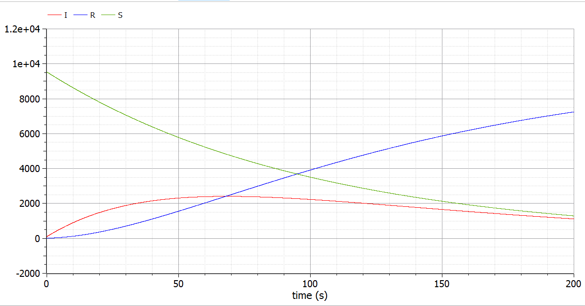

---
# Front matter
lang: ru-RU
title: "Лабораторная работа №6"
subtitle: "Модель эпидемии"
author: "Валиева Найля Разимовна"

# Formatting
toc-title: "Содержание"
toc: true # Table of contents
toc_depth: 2
lof: true # List of figures
lot: true # List of tables
fontsize: 12pt
linestretch: 1.5
papersize: a4paper
documentclass: scrreprt
polyglossia-lang: russian
polyglossia-otherlangs: english
mainfont: PT Serif
romanfont: PT Serif
sansfont: PT Sans
monofont: PT Mono
mainfontoptions: Ligatures=TeX
romanfontoptions: Ligatures=TeX
sansfontoptions: Ligatures=TeX,Scale=MatchLowercase
monofontoptions: Scale=MatchLowercase
indent: true
pdf-engine: lualatex
header-includes:
  - \linepenalty=10 # the penalty added to the badness of each line within a paragraph (no associated penalty node) Increasing the value makes tex try to have fewer lines in the paragraph.
  - \interlinepenalty=0 # value of the penalty (node) added after each line of a paragraph.
  - \hyphenpenalty=50 # the penalty for line breaking at an automatically inserted hyphen
  - \exhyphenpenalty=50 # the penalty for line breaking at an explicit hyphen
  - \binoppenalty=700 # the penalty for breaking a line at a binary operator
  - \relpenalty=500 # the penalty for breaking a line at a relation
  - \clubpenalty=150 # extra penalty for breaking after first line of a paragraph
  - \widowpenalty=150 # extra penalty for breaking before last line of a paragraph
  - \displaywidowpenalty=50 # extra penalty for breaking before last line before a display math
  - \brokenpenalty=100 # extra penalty for page breaking after a hyphenated line
  - \predisplaypenalty=10000 # penalty for breaking before a display
  - \postdisplaypenalty=0 # penalty for breaking after a display
  - \floatingpenalty = 20000 # penalty for splitting an insertion (can only be split footnote in standard LaTeX)
  - \raggedbottom # or \flushbottom
  - \usepackage{float} # keep figures where there are in the text
  - \floatplacement{figure}{H} # keep figures where there are in the text
---

# Цель работы

Ознакомление с простейшей моделью Эпидемии  и ее построение с помощью языка программирования Modelica. 

# Задание

1. Построить графики изменения числа особей в каждой из трех групп (восприимчивые к болезни (S), заболевшие люди (I), здоровые люди с иммунитетом (R)), если I(0) \leq I* (число инфицированных не превышает критического значения).
2. Построить графики изменения числа особей в каждой из трех групп (восприимчивые к болезни (S), заболевшие люди (I), здоровые люди с иммунитетом (R)), если I(0) > I* (число инфицированных выше критического значения).

# Выполнение лабораторной работы
  

Предположим, что некая популяция, состоящая из N особей, (считаем, что популяция изолирована) подразделяется на три группы. Первая группа - это восприимчивые к болезни, но пока здоровые особи, обозначим их через S(t). Вторая группа – это число
инфицированных особей, которые также при этом являются распространителями инфекции, обозначим их I(t). А третья группа, обозначающаяся через R(t) – это здоровые особи с иммунитетом к болезни.

До того, как число заболевших не превышает критического значения I* , считаем, что все больные изолированы и не заражают здоровых. Когда I(t) > I*, тогда инфицирование способны заражать восприимчивых к болезни особей.

Cкорость изменения числа особей, восприимчивых к болезни S(t) меняется по следующему закону:
$$ \frac{dS}{dt} = \begin{cases} -\alpha S, если I(t) > I^* \\ 0, если I(t) \leq I^* \end{cases} $$

Скорость изменения числа инфекционных особей I(t) меняется по следующему закону:
$$ \frac{dI}{dt} = \begin{cases} \alpha S - \beta I, если I(t) > I^* \\ - \beta I, если I(t) \leq I^* \end{cases} $$

Скорость изменения числа выздоравливающих особей R(t) меняется по следующему закону:
$$ \frac{dI}{dt} = \beta I $$

В нашем случае $\alpha=0.01$ - коэффициент заболеваемости, а $\beta = 0.02$ - коэффициент выздоравливаемости.

Ниже приведен код программы, реализованный на языке программирования Modelica (Вариант 52) (рис 1. -@fig:001)  

{ #fig:001 width=70% }

1. Построим графики изменения числа инфекционных особей I(t) и числа выздоравливающих особей R(t), если число инфицированных не превышает критического значения (рис 2. -@fig:001)  

{ #fig:001 width=70% }

Добавим график изменения числа особей, восприимчивых к болезни S(t), если число инфицированных не превышает критического значения (рис 3. -@fig:001)  

{ #fig:001 width=70% }

2. Теперь же построим графики изменения числа особей, восприимчивых к болезни S(t), числа инфекционных особей I(t) и числа выздоравливающих особей R(t), если число инфицированных выше критического значения (рис 4. -@fig:001)  

{ #fig:001 width=70% }

# Код программы

model lab06
parameter Real a = 0.01; //коэффициент заболеваемости 

parameter Real b = 0.02; //коэффициент выздоровления

parameter Real N = 9654; //общая численность популяции

parameter Real I0 = 100; // количество инфицированных особей в начальный момент времени

parameter Real R0 = 20; // количество здоровых особей с иммунитетом в начальный момент времени

parameter Real S0 = N - I0 - R0; //количество восприимчивых к болезни особей в начальный момент времени

Real S(start=S0);

Real I(start=I0);

Real R(start=R0);

equation

//случай, когда I(0)<=I*

//der(S) = 0;

//der(I) = -b*I;

//der(R) = b*I;

//случай, когда I(0)>I*

der(S) = -a*S;

der(I) = a*S - b*I;

der(R) = b*I;

end lab06;

# Выводы

Я ознакомилась с простейшей моделью Эпидемии, построила для нее графики изменения числа особей в трех группах для двух случаев: I(0) \leq I* и I(0) > I*.
