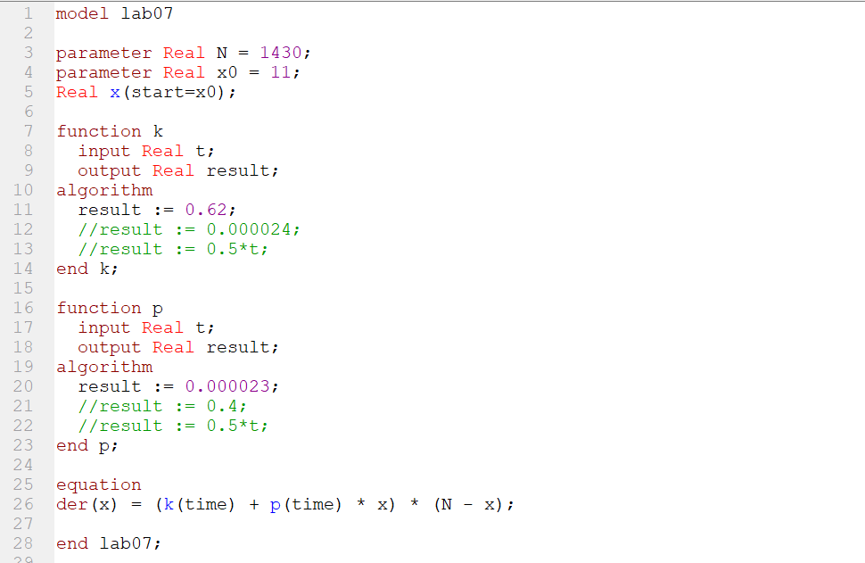
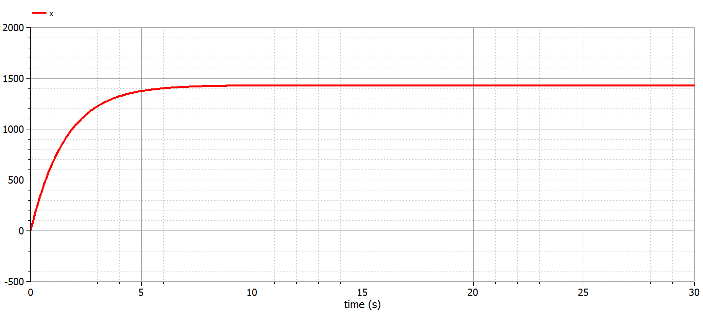
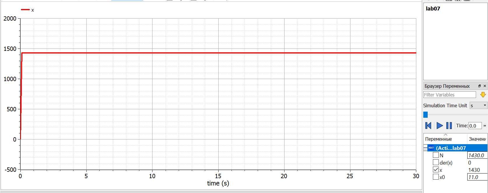
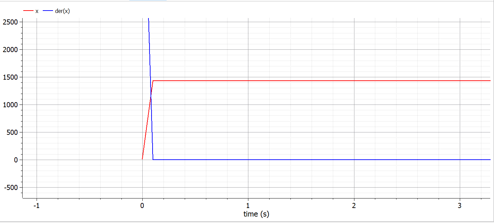
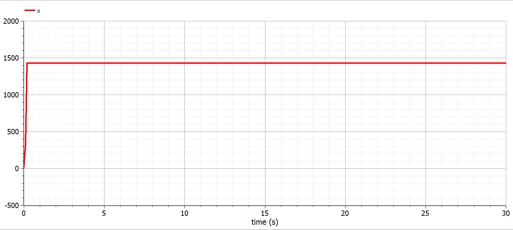

---
# Front matter
lang: ru-RU
title: "Лабораторная работа №7"
subtitle: "Модель эффективности рекламы"
author: "Валиева Найля Разимовна"

# Formatting
toc-title: "Содержание"
toc: true # Table of contents
toc_depth: 2
lof: true # List of figures
lot: true # List of tables
fontsize: 12pt
linestretch: 1.5
papersize: a4paper
documentclass: scrreprt
polyglossia-lang: russian
polyglossia-otherlangs: english
mainfont: PT Serif
romanfont: PT Serif
sansfont: PT Sans
monofont: PT Mono
mainfontoptions: Ligatures=TeX
romanfontoptions: Ligatures=TeX
sansfontoptions: Ligatures=TeX,Scale=MatchLowercase
monofontoptions: Scale=MatchLowercase
indent: true
pdf-engine: lualatex
header-includes:
  - \linepenalty=10 # the penalty added to the badness of each line within a paragraph (no associated penalty node) Increasing the value makes tex try to have fewer lines in the paragraph.
  - \interlinepenalty=0 # value of the penalty (node) added after each line of a paragraph.
  - \hyphenpenalty=50 # the penalty for line breaking at an automatically inserted hyphen
  - \exhyphenpenalty=50 # the penalty for line breaking at an explicit hyphen
  - \binoppenalty=700 # the penalty for breaking a line at a binary operator
  - \relpenalty=500 # the penalty for breaking a line at a relation
  - \clubpenalty=150 # extra penalty for breaking after first line of a paragraph
  - \widowpenalty=150 # extra penalty for breaking before last line of a paragraph
  - \displaywidowpenalty=50 # extra penalty for breaking before last line before a display math
  - \brokenpenalty=100 # extra penalty for page breaking after a hyphenated line
  - \predisplaypenalty=10000 # penalty for breaking before a display
  - \postdisplaypenalty=0 # penalty for breaking after a display
  - \floatingpenalty = 20000 # penalty for splitting an insertion (can only be split footnote in standard LaTeX)
  - \raggedbottom # or \flushbottom
  - \usepackage{float} # keep figures where there are in the text
  - \floatplacement{figure}{H} # keep figures where there are in the text
---

# Цель работы

Ознакомление с моделью Мальтуса и моделью логистической кривой на примере рекламной кампании и их построение с помощью языка программирования Modelica. 

# Задание

1. Построить график распространения рекламы, математическая модель которой описывается следующим уравнением: $\frac{dn}{dt} = (0.62+0.000023n(t))(N-n(t))$
2. Построить график распространения рекламы, математическая модель которой описывается следующим уравнением: $\frac{dn}{dt} = (0.000024+0.4n(t))(N-n(t))$  
Для этого случая определить, в какой момент времени скорость распространения рекламы будет иметь максимальное значение.
3. Построить график распространения рекламы, математическая модель которой описывается следующим уравнением: $\frac{dn}{dt} = (0.5t+0.5tn(t))(N-n(t))$

# Выполнение лабораторной работы

После запуска рекламных объявлений скорость изменения числа знающих о продукции людей пропорциональна как числу знающих о товаре покупателей, так и числу покупателей о нем не знающих.  
Известны начальные данные: N = 1430 - объем аудитории, n~0~ = 11 - число людей, знакомых с рекламой в начальный момент времени.

Ниже првиеден код для решения задачи (рис -@fig:001)  

{ #fig:001 width=70% }

1. Построим график распространения рекламы, математическая модель которой описывается следующим уравнением: $\frac{dn}{dt} = (0.62+0.000023n(t))(N-n(t))$ (рис -@fig:002)  

{ #fig:002 width=70% }

2. Построим график распространения рекламы, математическая модель которой описывается следующим уравнением: $\frac{dn}{dt} = (0.000024+0.4n(t))(N-n(t))$ (рис -@fig:003)  

{ #fig:003 width=70% }

Также нам требуется определить, каким будет максимальное значение скорости распространения рекламы в данном случае. Скорость распространения рекламы - производная по графику распространения рекламы.
Следовательно, максимальное значение будет там, где значение графика скорости максимально. Из приведенного рисунка (рис -@fig:004) мы видим, что значение графика производной максимально
в начальный момент времени t~0~ = 0.

{ #fig:004 width=70% }

3. Построим график распространения рекламы, математическая модель которой описывается следующим уравнением: $\frac{dn}{dt} = (0.5t+0.5tn(t))(N-n(t))$ (рис -@fig:005)  

{ #fig:005 width=70% }

# Ответы на вопросы

1. Записать модель Мальтуса (дать пояснение, где используется данная модель)

$$ \frac{\partial N}{\partial t} = rN $$

Данная модель используется для расчета изменения популяции особей животных.

2. Записать уравнение логистической кривой (дать пояснение, что описывает данное уравнение)

$$ \frac{\partial P}{\partial t} = rP(1 - \frac{P}{K}) $$

Исходные предположения для вывода уравнения при рассмотрении популяционной динамики выглядят следующим образом:

- скорость размножения популяции пропорциональна её текущей численности, при прочих равных условиях;
- скорость размножения популяции пропорциональна количеству доступных ресурсов, при прочих равных условиях. Таким образом, второй член уравнения отражает конкуренцию за ресурсы, которая ограничивает рост популяции.

3. На что влияет коэффициент $\alpha_1(t)$ и $\alpha_2(t)$ в модели распространения рекламы

$\alpha_1(t)$ — интенсивность рекламной кампании, зависящая от затрат

$\alpha_2(t)$ — интенсивность рекламной кампании, зависящая от сарафанного радио

4. Как ведет себя рассматриваемая модель при $\alpha_1(t) \gg \alpha_2(t)$

При $\alpha_1(t) \gg \alpha_2(t)$ получается модель типа модели Мальтуса (рис. -@fig:006):

{ #fig:006 width=70% }

5. Как ведет себя рассматриваемая модель при $\alpha_1(t) \ll \alpha_2(t)$

При $\alpha_1(t) \ll \alpha_2(t)$ получаем уравнение логистической кривой (рис. -@fig:007):

{ #fig:007 width=70% }

# Код программы

model lab07

parameter Real N = 1430; 

parameter Real x0 = 11;

Real x(start=x0);

function k

  input Real t;
  
  output Real result;
  
algorithm

  result := 0.62;
  
  //result := 0.000024;
  
  //result := 0.5*t;
  
end k;

function p

  input Real t;
  
  output Real result;
  
algorithm

  result := 0.000023;
  
  //result := 0.4;
  
  //result := 0.5*t;
  
end p;

equation

der(x) = (k(time) + p(time) * x) * (N - x);

end lab07;

# Выводы

Я ознакомилась с моделью Мальтуса и моделью логистической кривой на примере эффективности рекламы и построила соответствующие графики. 
