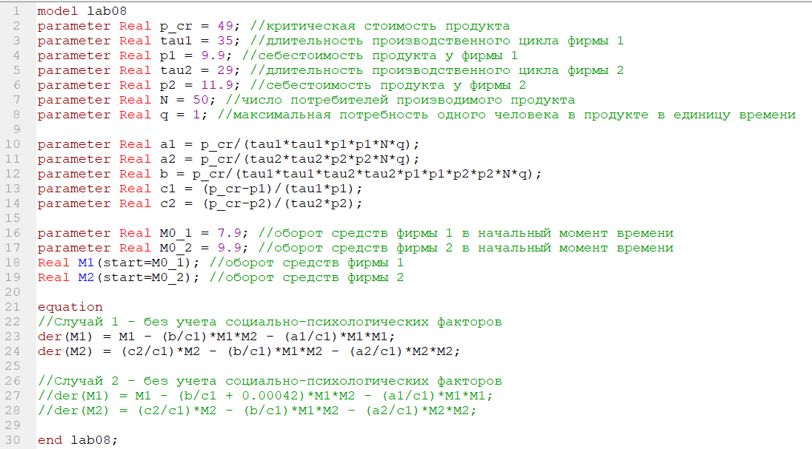
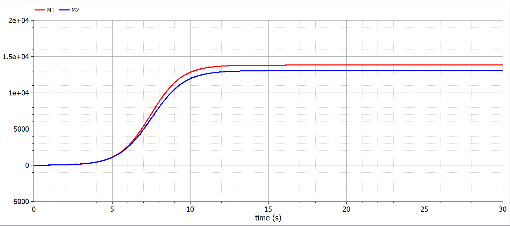
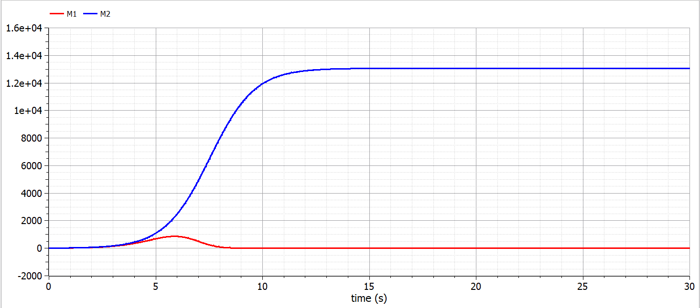

---
# Front matter
lang: ru-RU
title: "Лабораторная работа №8"
subtitle: "Модель конкуренции двух фирм"
author: "Валиева Найля Разимовна"

# Formatting
toc-title: "Содержание"
toc: true # Table of contents
toc_depth: 2
lof: true # List of figures
lot: true # List of tables
fontsize: 12pt
linestretch: 1.5
papersize: a4paper
documentclass: scrreprt
polyglossia-lang: russian
polyglossia-otherlangs: english
mainfont: PT Serif
romanfont: PT Serif
sansfont: PT Sans
monofont: PT Mono
mainfontoptions: Ligatures=TeX
romanfontoptions: Ligatures=TeX
sansfontoptions: Ligatures=TeX,Scale=MatchLowercase
monofontoptions: Scale=MatchLowercase
indent: true
pdf-engine: lualatex
header-includes:
  - \linepenalty=10 # the penalty added to the badness of each line within a paragraph (no associated penalty node) Increasing the value makes tex try to have fewer lines in the paragraph.
  - \interlinepenalty=0 # value of the penalty (node) added after each line of a paragraph.
  - \hyphenpenalty=50 # the penalty for line breaking at an automatically inserted hyphen
  - \exhyphenpenalty=50 # the penalty for line breaking at an explicit hyphen
  - \binoppenalty=700 # the penalty for breaking a line at a binary operator
  - \relpenalty=500 # the penalty for breaking a line at a relation
  - \clubpenalty=150 # extra penalty for breaking after first line of a paragraph
  - \widowpenalty=150 # extra penalty for breaking before last line of a paragraph
  - \displaywidowpenalty=50 # extra penalty for breaking before last line before a display math
  - \brokenpenalty=100 # extra penalty for page breaking after a hyphenated line
  - \predisplaypenalty=10000 # penalty for breaking before a display
  - \postdisplaypenalty=0 # penalty for breaking after a display
  - \floatingpenalty = 20000 # penalty for splitting an insertion (can only be split footnote in standard LaTeX)
  - \raggedbottom # or \flushbottom
  - \usepackage{float} # keep figures where there are in the text
  - \floatplacement{figure}{H} # keep figures where there are in the text
---

# Цель работы

Ознакомление с моделью конкуренции двух фирм для двух случаев (без учета и с учетом социально-психологического фактора) и их построение с помощью языка программирования Modelica. 

# Задание

1. Построить графики изменения оборотных средств фирмы 1 и фирмы 2 без учета постоянных издержек и с введенной нормировкой для случая 1 (без учета социально-психологического фактора).
2. Построить графики изменения оборотных средств фирмы 1 и фирмы 2 без учета постоянных издержек и с введенной нормировкой для случая 2 (с учетом социально-психологического фактора).

# Выполнение лабораторной работы

Система уравнений для первого случая (без учета социально-психологического фактора):

$$ \frac{dM_1}{d\theta} = M_1 - \frac{b}{c_1} M_1 M_2 - \frac{a_1}{c_1} M_1^2 $$

$$ \frac{dM_2}{d\theta} = \frac{c_2}{c_1} M_2 - \frac{b}{c_1} M_1 M_2-\frac{a_2}{c_1} M_2^2 $$

где $$ a_1 = \frac{p_{cr}}{{\tau}_1^2 p_1^2 N q }, a_2 = \frac{p_{cr}}{{\tau}_2^2 p_2^2 N q}, b = \frac{p_{cr}}{{\tau}_1^2 p_1^2 {\tau}_2^2 p_2^2 N q } $$
$$ c_1 = \frac{p_{cr} - p_1}{{\tau}_1 p_1}, c_2 = \frac{p_{cr} - p_2}{{\tau}_2 p_2}$$  

Также введена нормировка $t = c_1 \theta$.  

Система уравнений для второго случая (с учетом социально-психологического фактора) принимает следующий вид:

$$ \frac{dM_1}{d\theta} = M_1 - (\frac{b}{c_1} + 0.00042) M_1 M_2-\frac{a_1}{c_1} M_1^2 $$

$$ \frac{dM_2}{d\theta} = \frac{c_2}{c_1} M_2 - \frac{b}{c_1} M_1 M_2-\frac{a_2}{c_1} M_2^2 $$

Начальные условия для обеих задач принимают следующий вид:  

$$ M_0^1 = 7.9, M_0^2 = 9.9, p_cr = 49, N = 50, q = 1, \tau_1 = 35, \tau_2 = 29, p_1 = 9.9, p_2 = 11.9$$ 
 
Обозначения:  

N - число потребителей производимого продукта 
 
$\tau$ - длительность производственного цикла  

p~cr~ - критическая стоимость продукта  

p - себестоимость продукта  

q - максимальная потребность одного человека в продукте в единицу времени  

$\theta=\frac{t}{c_1}$ - безразмерное время.

Тогда с учетом вышеприведенных условий код программы будет выглядить следующим образом  (рис -@fig:001)  

{ #fig:001 width=70% }

1. Построим графики изменения оборотных средств фирмы 1 и фирмы 2 для случая 1 (без учета социально-психологического фактора) (рис -@fig:002)  
Система уравнений для этого случая выглядит следующим образом:  

$$ \frac{dM_1}{d\theta} = M_1 - \frac{b}{c_1} M_1 M_2-\frac{a_1}{c_1} M_1^2 $$

$$ \frac{dM_2}{d\theta} = \frac{c_2}{c_1} M_2 - \frac{b}{c_1} M_1 M_2-\frac{a_2}{c_1} M_2^2 $$

{ #fig:002 width=70% }

2. Построим графики изменения оборотных средств фирмы 1 и фирмы 2 для случая 2 (с учетом социально-психологического фактора) (рис -@fig:003)  
Система уравнений для этого случая выглядит следующим образом:  

$$ \frac{dM_1}{d\theta} = M_1 - (\frac{b}{c_1} + 0.00042) M_1 M_2-\frac{a_1}{c_1} M_1^2 $$

$$ \frac{dM_2}{d\theta} = \frac{c_2}{c_1} M_2 - \frac{b}{c_1} M_1 M_2-\frac{a_2}{c_1} M_2^2 $$

{ #fig:003 width=70% }

# Код программы

model lab08

parameter Real p_cr = 49; //критическая стоимость продукта

parameter Real tau1 = 35; //длительность производственного цикла фирмы 1

parameter Real p1 = 9.9; //себестоимость продукта у фирмы 1

parameter Real tau2 = 29; //длительность производственного цикла фирмы 2

parameter Real p2 = 11.9; //себестоимость продукта у фирмы 2

parameter Real N = 50; //число потребителей производимого продукта

parameter Real q = 1; //максимальная потребность одного человека в продукте в единицу времени

parameter Real a1 = p_cr/(tau1*tau1*p1*p1*N*q);

parameter Real a2 = p_cr/(tau2*tau2*p2*p2*N*q);

parameter Real b = p_cr/(tau1*tau1*tau2*tau2*p1*p1*p2*p2*N*q);

parameter Real c1 = (p_cr-p1)/(tau1*p1);

parameter Real c2 = (p_cr-p2)/(tau2*p2);

parameter Real M0_1 = 7.9; //оборот средств фирмы 1 в начальный момент времени

parameter Real M0_2 = 9.9; //оборот средств фирмы 2 в начальный момент времени

Real M1(start=M0_1); //оборот средств фирмы 1

Real M2(start=M0_2); //оборот средств фирмы 2

equation

//Случай 1 - без учета социально-психологических факторов

der(M1) = M1 - (b/c1)*M1*M2 - (a1/c1)*M1*M1;

der(M2) = (c2/c1)*M2 - (b/c1)*M1*M2 - (a2/c1)*M2*M2;

//Случай 2 - без учета социально-психологических факторов

//der(M1) = M1 - (b/c1 + 0.00042)*M1*M2 - (a1/c1)*M1*M1;

//der(M2) = (c2/c1)*M2 - (b/c1)*M1*M2 - (a2/c1)*M2*M2;

end lab08;

# Выводы

Я ознакомилась с моделью конкуренции двух фирм для двух случаев (без учета и с учетом социально-психологического фактора) и построила соответствующие графики.